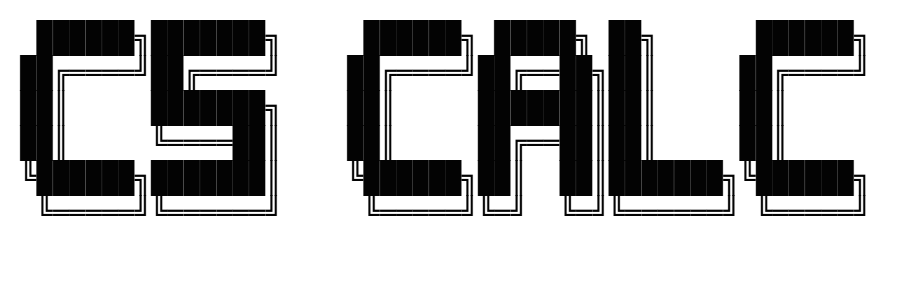

<div align="center">
  
</div>   

# 🧮 CS Calculator Pro

> *A powerful desktop tool for computer science students —*
> *convert between number systems and analyze IPv4 addresses instantly.*

<br/>

[](https://python.org)
[](https://docs.python.org/3/library/tkinter.html)
[](./test_cs.py)
[](./cs_logic.py)
[](./LICENSE)
[](.)

<br/>

| 🔢 Multi-base arithmetic | 🔄 6 number conversions | 🌐 IPv4 analysis | ✅ 21 unit tests |
|:---:|:---:|:---:|:---:|
| Dec · Bin · Hex | Dec↔Bin · Dec↔Hex · Bin↔Hex | Class · Mask · Network · Broadcast | pytest + flake8 |

</div>

---

## 🛠️ Built With

<br/>

<div align="center">

### Core Language & Environment

<a href="https://python.org">
  
</a>
&nbsp;&nbsp;
<a href="https://jupyter.org">
  
</a>

<br/><br/>

### Standard Library — No pip install needed

<a href="https://docs.python.org/3/library/tkinter.html">
  
</a>
&nbsp;&nbsp;
<a href="https://docs.python.org/3/library/ipaddress.html">
  
</a>
&nbsp;&nbsp;
<a href="https://docs.python.org/3/library/re.html">
  
</a>

<br/><br/>

### Code Quality Tools

<a href="https://pytest.org">
  
</a>
&nbsp;&nbsp;
<a href="https://flake8.pycqa.org">
  
</a>

<br/><br/>

</div>

---

## ✨ Features

### Tab 1 — Calculator
| Feature | Description |
|--------|-------------|
| **Multi-base arithmetic** | Perform `+` `−` `×` `÷` directly in Decimal, Binary, or Hexadecimal |
| **6 conversions** | Dec→Bin, Bin→Dec, Dec→Hex, Hex→Dec, Bin→Hex, Hex→Bin |
| **Mode switching** | Cycle between Decimal / Binary / Hex with one click |
| **Expression parsing** | Handles expressions like `A+5` in Hex or `101+10` in Binary |

### Tab 2 — IP Tools
| Feature | Description |
|--------|-------------|
| **IP validation** | Validates any IPv4 address using Python's `ipaddress` stdlib |
| **IP classification** | Automatically detects Class A / B / C / Special |
| **Network info** | Displays subnet mask, network address, and broadcast address |
| **Binary conversion** | Converts each octet to 8-bit binary (e.g. `192.168.1.1` → `11000000.10101000.00000001.00000001`) |

---

## 🖥️ Demo

> **Tab 1 — Calculator**

```
Input : FF + 1       Mode: Hex    →   Output: 100
Input : 1010 + 10    Mode: Binary →   Output: 1100
Input : 255          Dec→Hex      →   Output: FF
Input : 11111111     Bin→Dec      →   Output: 255
```

> **Tab 2 — IP Tools**

```
Input : 192.168.1.50
─────────────────────────────
  Status    →  IP Valide ✅
  Class     →  Classe C
  Mask      →  255.255.255.0
  Network   →  192.168.1.0
  Broadcast →  192.168.1.255
  Binary    →  11000000.10101000.00000001.00110010
```

---

## 📁 Project Structure

```
cs-calculator-pro/
│
├── CS_final_version.ipynb   # Main Jupyter Notebook (full app)
├── cs_logic.py              # Pure logic functions (extracted for testing)
├── test_cs.py               # Unit tests (pytest)
├── README.md
└── LICENSE
```

---

## 🚀 Getting Started

### Prerequisites

- Python 3.10+
- Jupyter Notebook or JupyterLab

### Installation

```bash
# 1. Clone the repository
git clone https://github.com/AfafKenanda/cs-calculator-pro.git
cd cs-calculator-pro

# 2. (Optional) Create a virtual environment
python -m venv venv
source venv/bin/activate      # Linux / macOS
venv\Scripts\activate         # Windows

# 3. Install dependencies
pip install jupyter
```

> `tkinter` and `ipaddress` are part of Python's standard library — no extra install needed.

### Run the app

```bash
jupyter notebook CS_final_version.ipynb
```

Then run the single cell to launch the Tkinter window.

---

## 🧪 Code Quality

### Run tests

```bash
pip install flake8 pytest

# Style check
flake8 cs_logic.py --max-line-length=100

# Unit tests
pytest test_cs.py -v
```

### Test results

```
test_cs.py::test_safe_eval_hex_simple       PASSED
test_cs.py::test_safe_eval_hex_addition     PASSED
test_cs.py::test_safe_eval_binary_simple    PASSED
test_cs.py::test_safe_eval_binary_addition  PASSED
test_cs.py::test_dec_to_bin                 PASSED
test_cs.py::test_bin_to_dec                 PASSED
test_cs.py::test_dec_to_hex                 PASSED
test_cs.py::test_hex_to_dec                 PASSED
test_cs.py::test_bin_to_hex                 PASSED
test_cs.py::test_hex_to_bin                 PASSED
test_cs.py::test_ip_valid_classe_a          PASSED
test_cs.py::test_ip_valid_classe_b          PASSED
test_cs.py::test_ip_valid_classe_c          PASSED
test_cs.py::test_ip_network_address         PASSED
test_cs.py::test_ip_broadcast_address       PASSED
test_cs.py::test_ip_invalide                PASSED
test_cs.py::test_ip_invalide_texte          PASSED
test_cs.py::test_ip_to_binary_normal        PASSED
test_cs.py::test_ip_to_binary_zeros         PASSED
test_cs.py::test_ip_to_binary_max           PASSED
test_cs.py::test_ip_to_binary_invalide      PASSED

========================= 21 passed in 0.33s =========================
```

**flake8:** `0 errors, 0 warnings` ✅

---

## 🏗️ Architecture

```
User Input
    │
    ▼
┌─────────────────────────────────────────┐
│           Tkinter Window                │
│   ┌──────────────┬──────────────────┐   │
│   │  Tab 1       │  Tab 2           │   │
│   │  Calculator  │  IP Tools        │   │
│   └──────┬───────┴──────┬───────────┘   │
└──────────┼──────────────┼───────────────┘
           │              │
    ┌──────▼──────┐  ┌────▼──────────────┐
    │ safe_eval() │  │   validate_ip()   │
    │ conversion()│  │   ip_to_binary()  │
    └──────┬──────┘  └────┬──────────────┘
           │              │
    ┌──────▼──────────────▼──────┐
    │       Output Display       │
    │   output_entry / ip_output │
    └────────────────────────────┘
```

---

## 👨‍💻 Author

**Afaf Kenanda**  
Student @ University TAHRI Mohammed of Bechar  
Mini-Project — Fundamentals and Techniques of Programming

---

## 📄 License

This project is licensed under the **MIT License** — see the [LICENSE](LICENSE) file for details.

---

<div align="center">
Made with Python for the FTP Mini-Project · University of Bechar
</div>
